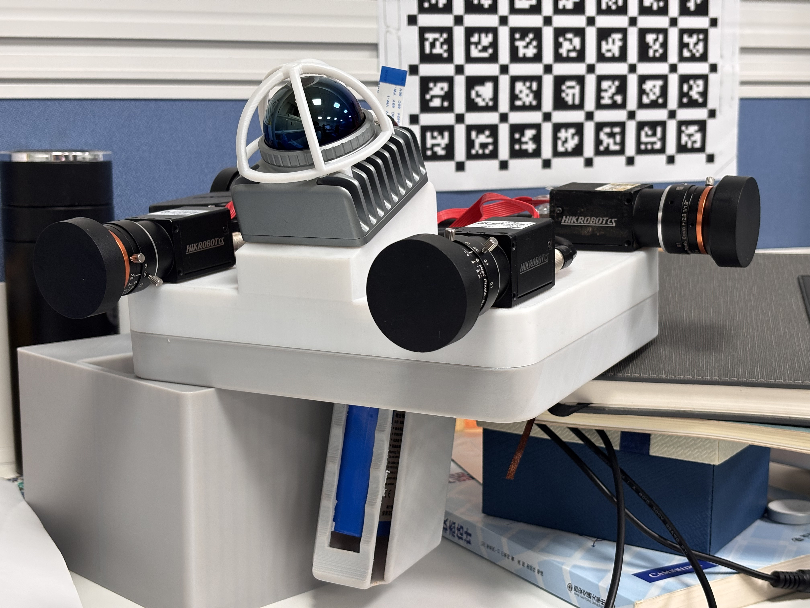
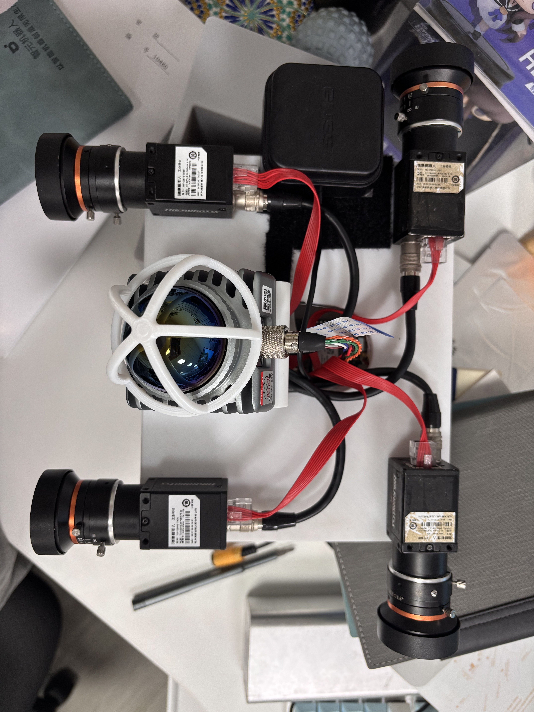

# 2026project

An open-source repository for the 2026 device project.

This repository is intended to keep the project code, device information,
documentation, and 3D model assets in one public, reusable place.

## Repository Structure

```text
2026project/
  README.md          Project overview and public entry point
  LICENSE            Open-source license
  docs/              Design notes and user documentation
  hardware/          Device types, device list, and bill of materials
  models/            3D model files for devices and mechanical parts
  src/               Source code
  examples/          Example code and usage demos
```

## Device Types

The project currently uses the following core hardware components.

| Category | Device Used | Description |
| --- | --- | --- |
| Computer | LubanCat 4 (RK3588S2) | Main onboard computer for system control, computation, and device coordination |
| LiDAR | Livox MID360s | 3D sensing module for spatial perception and environment mapping |
| Camera | Hikvision MV-CS016-10GC x4 | Four industrial cameras for multi-view image capture |
| Lens | MVL-HF03524M-MP x4 | Four camera lenses matched with the Hikvision camera modules |
| IMU (LiDAR built-in) | ICM40609 | Built-in IMU inside the Livox MID360s module |
| IMU (additional) | ADIS16465 | Additional IMU for motion and orientation reference |
| GNSS Receiver | u-blox ZED F9P | High-precision positioning receiver for global navigation data |
| Antenna | Beitian BT-256 | GNSS antenna used with the positioning receiver |
| Network Switch | Qiandezhi commercial 1000 Mbps gigabit switch | Gigabit wired network hub for onboard device communication |
| Power | 4800 mAh lithium battery | Portable battery power source for the device system |

Detailed device notes, quantities, interfaces, and open items are maintained in
[`hardware/README.md`](hardware/README.md).

## 3D Models

The project includes a 3D preview of the device and the source CAD files used
for mechanical design and 3D printing. The full device assembly is provided as
[`Device.STEP`](models/device/Device.STEP), and the handheld mold parts are
available as [`bottom_new.STEP`](models/handheld/bottom_new.STEP) and
[`top_new.STEP`](models/handheld/top_new.STEP). These files are stored under
the [`models/`](models/) directory.

## Visual Preview

The 3D model preview and physical prototype photos are shown together below.

<p align="center">
  
  
  
</p>

Large 3D files should be managed with Git LFS when they become too large for
normal Git history.

## Time Synchronization

LiDAR, cameras, and the MID360s built-in IMU are synchronized to the host
through PTP. The hardware clock of the host network interface works as the PTP
master, while the camera exposure timing is aligned through the internal action
trigger mechanism of the Hikvision cameras. The ADIS16465 IMU is synchronized by
timestamping its Data Ready (DR) signal with the host local clock; the DR signal
indicates that a new ADIS16465 sample is ready, and its signal time differs from
the sampling time by about 1 ms. GNSS timestamps are converted from UTC or GPS
time generated by the receiver to UNIX time. Because the host receives time over
the network, GNSS position timestamps can have millisecond-level latency
relative to the host's real time.

More details are documented in
[`docs/time-synchronization.md`](docs/time-synchronization.md).

## Ground Truth Calculation

For open outdoor scenarios, the project prioritizes RTK positioning results as
the ground truth reference. The u-blox ZED F9P four-constellation RTK solution
has a nominal accuracy of 0.01 m + 1 ppm horizontally and 0.02 m + 1 ppm
vertically.

More details are documented in
[`docs/ground-truth.md`](docs/ground-truth.md).

## Getting Started

Clone the repository:

```bash
git clone https://github.com/IF-A-CAT/2026project.git
cd 2026project
```

Project-specific setup instructions will be added after the code structure is
finalized.

## Contributing

Contributions are welcome. Please keep changes organized by area:

- Code changes go in `src/`
- Example usage goes in `examples/`
- Device information goes in `hardware/`
- 3D models go in `models/`
- Design and usage documentation goes in `docs/`

## License

This project is released under the license included in [`LICENSE`](LICENSE).
